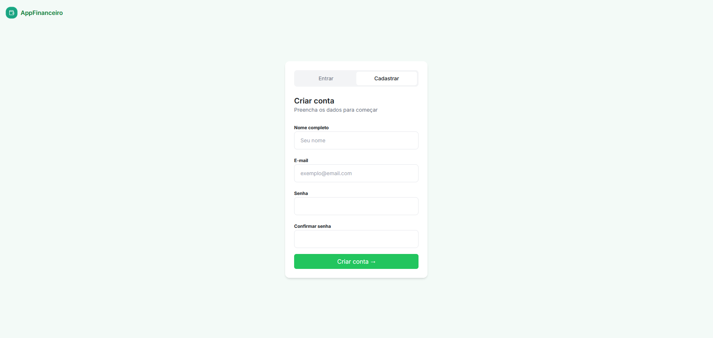
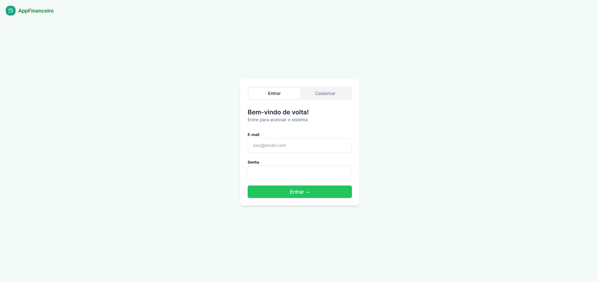
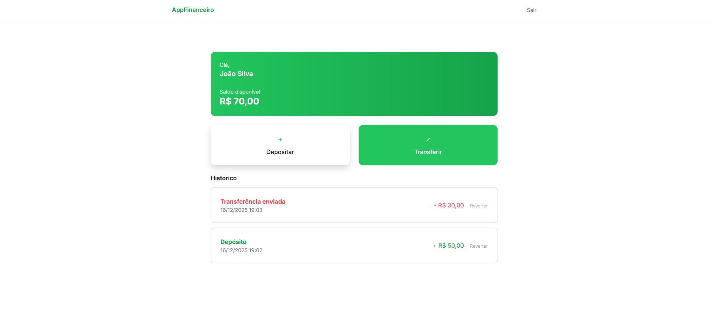
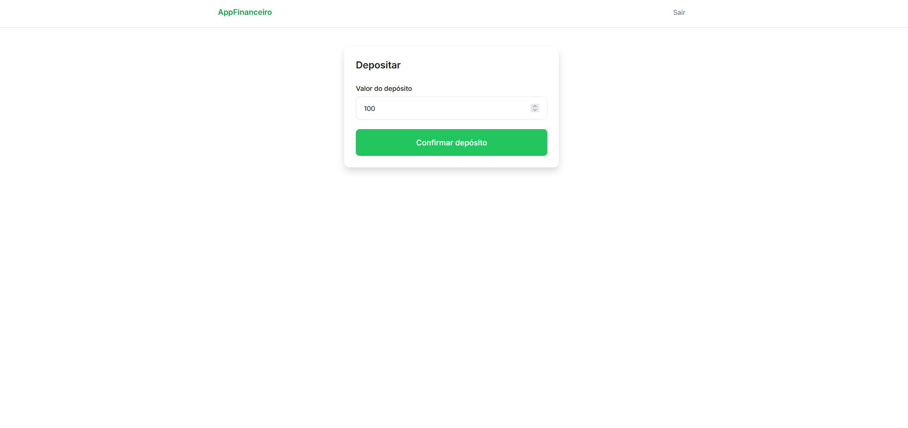
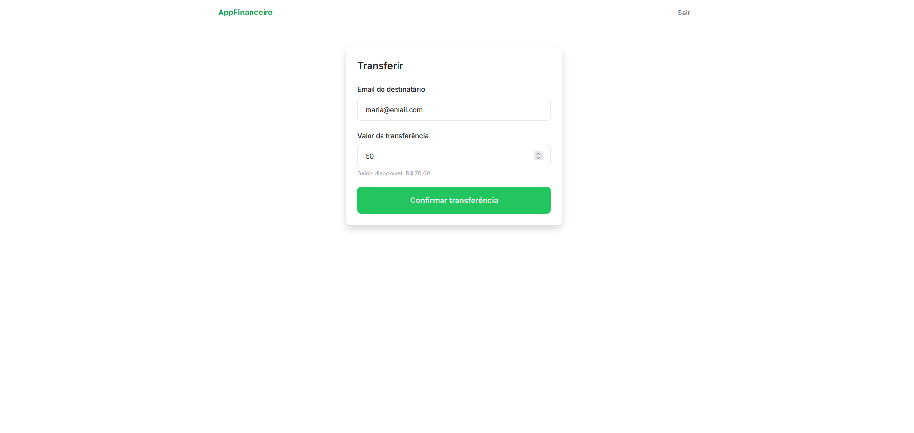

# 💰 Teste Técnico: Desenvolvedor Full Stack - Grupo Adriano Cobuccio

Aplicação web desenvolvida em **Laravel** que simula uma **carteira financeira**, permitindo que usuários realizem **depósitos, transferências e reversões**, respeitando regras de negócio e segurança.

---

## 🚀 Funcionalidades

- Cadastro e autenticação de usuários
- Cada usuário possui uma carteira
- Depósito de valores
- Transferência de valores entre usuários
- Reversão de operações (depósitos e transferências)
- Histórico de transações
- Controle de acesso e validações
- Interface simples e responsiva

---

## 🛣️ Rotas do Sistema

### Autenticação
| Método | Rota | Descrição |
|------|------|-----------|
| GET | `/login` | Tela de login |
| POST | `/login` | Autenticação |
| GET | `/register` | Tela de cadastro |
| POST | `/register` | Criação de usuário |
| POST | `/logout` | Logout |

Essas rotas possuem rate limit configurado para evitar ataques de força bruta e spam de cadastros.

### Dashboard
| Método | Rota | Descrição |
|------|------|-----------|
| GET | `/dashboard` | Tela principal com saldo e histórico |

### Wallet (Carteira)
| Método | Rota | Descrição |
|------|------|-----------|
| GET | `/deposit` | Tela de depósito |
| POST | `/deposit` | Realizar depósito |
| GET | `/transfer` | Tela de transferência |
| POST | `/transfer` | Realizar transferência |
| POST | `/transactions/{transaction}/revert` | Reverter operação |

Essas rotas também estão utilizando rate limiting para evitar requisições repetidas em curto intervalo de tempo.

---

## 📜 Regras de Negócio

### Wallet (Carteira)
- Cada usuário possui exatamente **uma carteira**
- O saldo nunca pode ser negativo
- Toda alteração de saldo é feita exclusivamente pela entidade `Wallet`

### Depósitos
- Apenas valores positivos são permitidos
- O depósito gera uma transação do tipo `DEPOSIT`
- Depósitos podem ser revertidos

### Transferências
- Transferências geram **duas transações**:
  - `TRANSFER_OUT` (remetente)
  - `TRANSFER_IN` (destinatário)
- Apenas o **remetente** pode iniciar uma reversão
- A reversão de transferência é feita por **grupo (`group_id`)**
- O destinatário **não pode** reverter uma transferência recebida

### Reversões
- Apenas operações `POSTED` podem ser revertidas
- Operações do tipo `REVERSAL` não podem ser revertidas
- A reversão aplica a **operação inversa**:
  - Depósito → saque
  - Transferência enviada → depósito
  - Transferência recebida → saque
- Todas as reversões são protegidas por transações de banco (`DB::transaction`)

---

## 🧠 Arquitetura e Decisões Técnicas

### Separação de Responsabilidades
- **Controller**: responsável apenas por HTTP, validação e resposta
- **Service**: implementa as regras de negócio
- **Model (Wallet)**: encapsula relacionamentos e regras de saldo
- **DTOs**: isolam a camada HTTP do domínio

### Concorrência e Consistência
- Uso de `lockForUpdate()` para evitar condições de concorrência
- Uso de `DB::transaction()` em todas as operações financeiras

### Validação com Form Requests
A aplicação utiliza **Form Requests** para centralizar validações, reduzindo o risco de dados inválidos chegarem aos Services e retornando mensagens de erro padronizados.

Exemplos de Requests:
- `RegisterRequest` → valida cadastro (nome, email único, senha confirmada)
- `LoginRequest` → valida credenciais
- `DepositRequest` → valida valores positivos e formato numérico
- `TransferRequest` → valida email do destinatário e valor válido

---

## 🧪 Testes

O projeto utiliza **Pest** para testes automatizados.

### Cobertura de Testes
- Depósito de valores
- Transferência entre usuários
- Saldo insuficiente
- Reversão de depósito
- Reversão de transferência
- Impedimento de reversão por usuário não autorizado

Os testes validam diretamente os **Services**, garantindo integridade do domínio sem depender da camada HTTP.

---

## 🎨 Interface (UI)

A interface foi construída com **Tailwind CSS**, priorizando simplicidade e clareza.

### Telas disponíveis:
- Login
- Cadastro
- Dashboard
- Depósito
- Transferência

### 🖼️ Imagens do Sistema

#### Cadastro


#### Login


#### Dashboard


#### Depósito


#### Transferência


---

## 🛠️ Tecnologias Utilizadas

- **Laravel** — Framework backend
- **PHP 8+**
- **Tailwind CSS** — Estilização
- **Pest** — Testes automatizados
- **Docker** — Ambiente de desenvolvimento
- **MySQL** — Persistência dos dados

---

## ▶️ Como executar o projeto

```bash
git clone <repositorio>
cd appfinanceiro
cp .env.example .env
docker compose up -d
composer install
php artisan key:generate
php artisan migrate
php artisan db:seed
